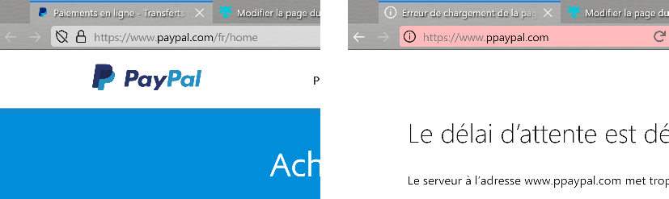

# SafeDom
Firefox extension / change address background color if current domain is not in bookmarks preventing phishing

## Installation from addons.mozilla.org
[SafeDom](https://addons.mozilla.org/fr/firefox/addon/safedom/)

## Manual installation for testing
Open about:debugging#/runtime/this-firefox load temporary addon and select "manifest.json" in the safedom folder.

## How it works
This addon will change the background color of the adress bar ifthe current website is not in the bookmarks

## Permissions
 * theme : To be able to change the colors
 * bookmarks : To check if current URL is in bookmark
 * history : To check if current URL is in history
 * tabs : To get the URL of the current tab
 * storage : To store the settings and a cache of the bookmarks

